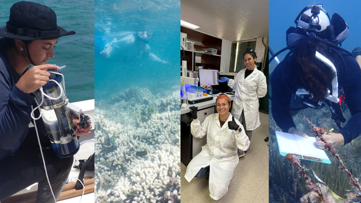
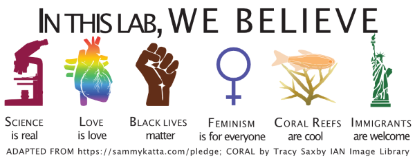

 
</a>

We are an interdisciplinary team of biogeochemists, ecologists, physiologists, and oceanographers in the [Department of Marine Sciences](https://www.uprm.edu/cima/) at the [University of Puerto Rico Mayagüez](https://www.uprm.edu/) researching how climate change and human impacts alter the functioning of marine ecosystems. 

While we currently work across a range of coastal ecosystems here in Puerto Rico, much of our research focuses on the quantifying the rates and drivers of the ecological function of coral reef building to better understand how environmental change affects the maintenance of coral reef structures and the ecosystem services those structures provide.

We also prioritize studies designed to address questions of interest to local governmental agencies, non-profits, and community groups. For example, we're currently collaborating with [ISER Caribe](https://www.isercaribe.org/) on a range of projects relating to [coral reef restoration](https://theberglab.com/projects/restorationmonitoring/) and [optimizing Ulva seaweed aquaculture](https://theberglab.com/projects/ulvaaquaculture/), the [Puerto Rico Department of Natural and Environmental Resources](https://www.drna.pr.gov/) on a project assessing [coral reef water quality](https://theberglab.com/projects/waterqualitymonitoring/), and are supporting students to lead environmental compliance monitoring of the [EcoEléctrica power plant ](https://theberglab.com/projects/environmentalcompliance/).

Please visit our [Team](https://theberglab.com/team/) and [Projects](https://theberglab.com/projects/) to pages to learn more about our current efforts and view our [Publications on Google Scholar](https://scholar.google.com/citations?hl=en&user=hK_DxtUAAAAJ) for a full list of our previous studies and contact Professor Travis (travis.courtney@upr.edu) to discuss any potential collaborations or to join our lab.

 
</a>

