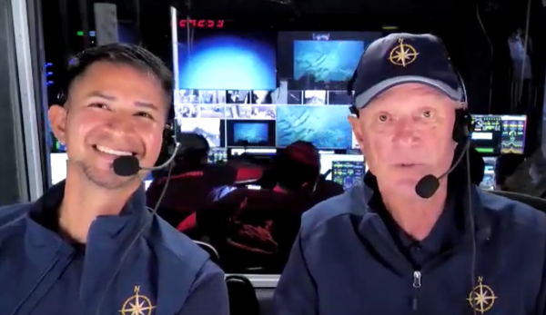

 

#### Videos and Media

[Ocean Exploration and Opportunities with Dr. Bob Ballard](https://www.youtube.com/watch?v=G9pe2rmXn1o)

#### Lesson Plans for K-12 Teachers

The following lesson plans were developed for K-12 teachers as part of the Scientific Research and Education Network:

<a href="./TravisCourtney_SciREN_OA_LessonPlan.pdf" download>SciREN 2014: Ocean Acidification Lesson Plan for Grades 9-12</a>

<a href="./TravisCourtney_SciREN_CoralReefDisturbances.pdf" download>SciREN 2020: Building Coral Reefs Under Climate Change Lesson Plan for Grades 9-12
</a>

#### Biogeochemistry + Ecology Research Group in the News
[An Interview with Dr. Travis Courtney – Marine Chemist and PLOS Author](https://everyone.plos.org/2022/01/27/an-interview-with-dr-travis-courtney-marine-chemist-and-plos-author/)

[Sloan Research Fellowship awarded to Dr. Travis Courtney](https://www.uprm.edu/portada/2024/03/01/catedraticodecienciasmarinasrecibelabecasloan/)