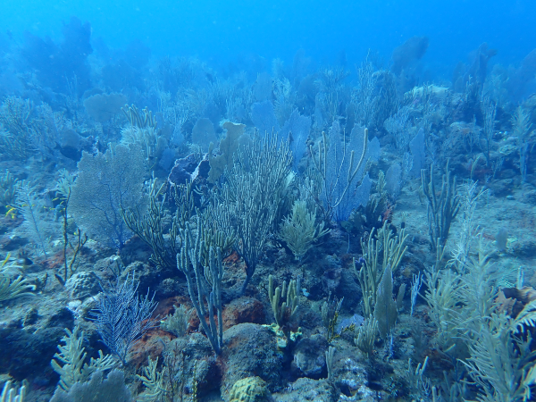

 

##### PI: Dr. Travis Courtney
##### Funded by the Office of Naval Research

This project aims to directly measure ecosystem-scale coral reef elevation changes over a multi-year period using an autonomous survey vehicle. These high resolution depth measurements will be combined with large area imagery to allow us to detect spatial variability in coral reef elevation changes and benthic ecology to attribute rates of elevation changes to specific taxa and substrates. We will also be directly testing whether [coral reef restoration](https://theberglab.com/research/restorationmonitoring/) increases coral reef growth through measurements of elevation changes in restored and non-restored areas.

