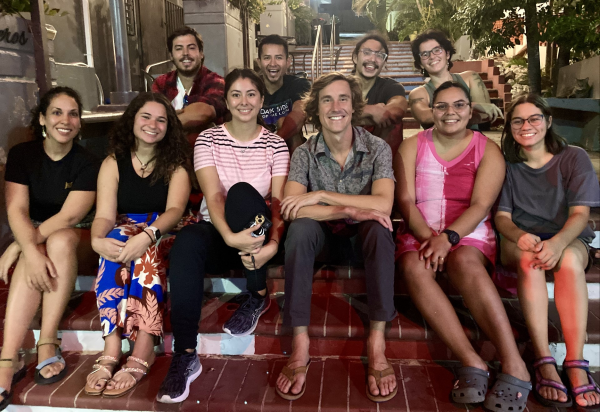

 

##### Co-PI: Dr. Travis Courtney, Dr. Andre Amador, and Dr. Johana Rotterová
##### Funded by the Office of Naval Research

The broader D-ENTERPRISE initiative aims to recruit students to the ocean sciences through establishing a collaborative network of regional hubs. The University of Puerto Rico Mayagüez, University of Massachusetts Boston, and University of Rhode Island collectively represent the east coast hub of D-ENTERPRISE. We are supporting annual cohorts of undergraduate and graduate students in the ocean sciences with assistantships, mentored research opportunities, monthly professional development, and an annual trip to explore opportunities in the ocean sciences between our institutions.  

