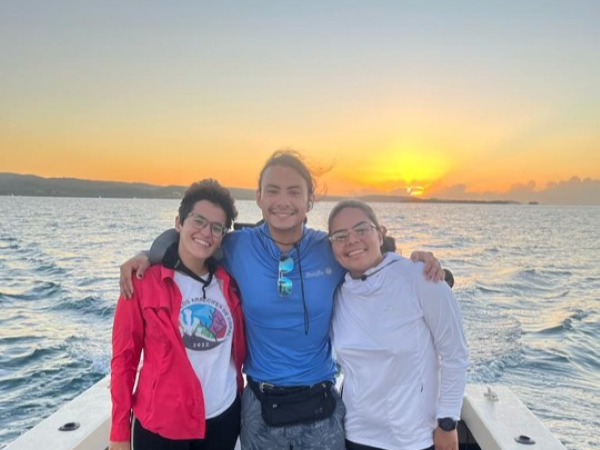

 

##### PI: Dr. Travis Courtney
##### Funded by EcoEléctrica and DNA Environment LLC

Professor Travis oversees professional MS students to monitor the seawater intake and outfall of the [EcoEléctrica](https://ecoelectrica.net/) power plant to ensure the facilities are operating within its regulatory guidelines. Students are supported by the environmental consulting firm, [DNA Environment](https://www.dnaenv.com/), to conduct monthly surveys and compile annual reports as part of a memorandum of understanding between the [University of Puerto Rico Mayagüez](https://www.uprm.edu/portada/) and [EcoEléctrica](https://ecoelectrica.net/). We are currently recruiting one student per year to learn the compliance monitoring, train the next year's student to lead the monitoring, and oversee the transition for the following year as part of a fully funded 2.5 year professional MS in Marine Sciences.

