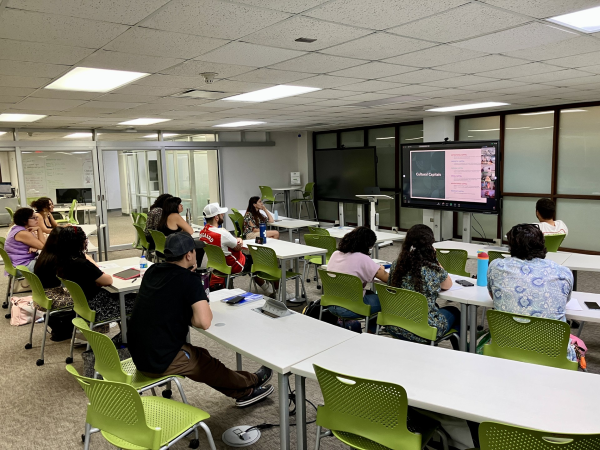
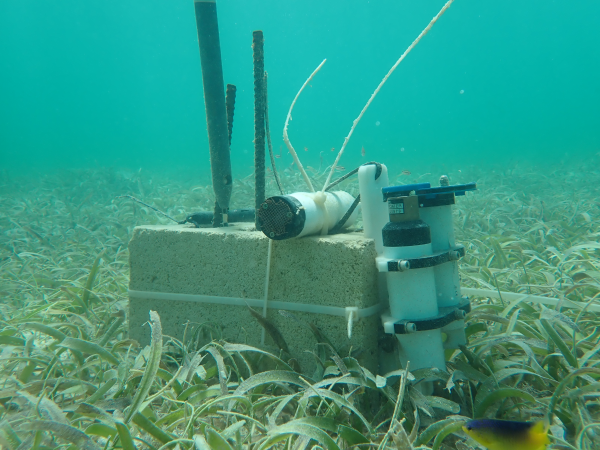

# D-ENTERPRISE

 

##### Co-PI: Dr. Travis Courtney, Dr. Andre Amador, and Dr. Johana Rotterová
##### Funded by the Office of Naval Research

The broader D-ENTERPRISE initiative aimed to increase diversity and inclusion in the ocean sciences through establishing a collaborative network of regional hubs between leading research universities and minority serving institutions complete with direct support and mentoring of students and faculty. Within this D-ENTERPRISE network, the Inclusion and Belonging in Ocean Science (IBOS) Collaborative was established between the University of Puerto Rico Mayagüez, University of Massachusetts Boston, and University of Rhode Island. The IBOS Collaborative supported annual cohorts of undergraduate and graduate students from underrepresented backgrounds in the ocean sciences with assistantships, mentored research opportunities, and monthly professional development.    

# Seagrass Carbon Dynamics

 

##### coPIs: Travis Courtney, Catherine Hernández Rodrigez
##### Funded by EcoEléctrica Outreach Programs

We are quantifying seagrass productivity, biogeochemical variability, pH buffering, and blue carbon uptake at contrasting sites in La Parguera Natural Reserve as part of Hernández Rodriguez's MS thesis. This project is also a part of the broader [Caribbean Carbon Accounting in Seagrass](https://seagrass.fiu.edu/caricas.htm) project led by Florida International University and funded by The Nature Conservancy.

