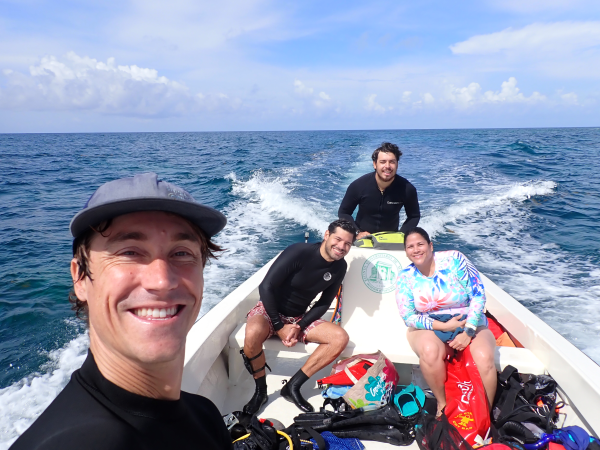

 

##### CoPI: Dr. Andre Amador and Dr. Travis Courtney
##### MOU Collaboration with Dr. Legna Torres and Dr. Lauren Toth at USGS
##### Funded by United States Geological Survey

This project aims to quantify how wave attenuation and shoreline protection are impacted by [coral reef restoration](https://theberglab.com/research/restorationmonitoring/). We will be deploying current meters and pressure sensors across a transect with active coral reef restoration and a non-restored area in Cayo El Palo to quantify the effects of coral reef restoration on seawater hydrodynamics, wave attenuation, and shoreline protection as part of [Rivera-Ramos's](https://theberglab.com/team/janluisrivera/) thesis. We will also perform large area surveys of the surrounding coral reef bathymetry using a personal water craft to improve modeling efforts led by Drs. Amador and Torres.

