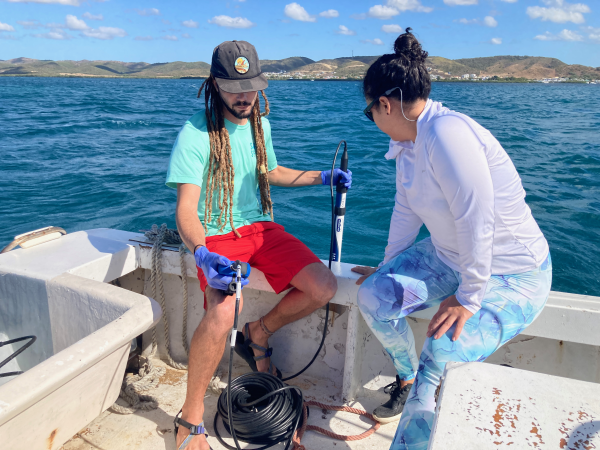

 

##### Co-PI: Dr. JJ Cruz Motta, Dr. Travis Courtney, and Dr. Ernesto Weil
##### Funded by Puerto Rico Department of Natural and Environmental Resources

We are currently working on a project to monitor 42 coral reef sites around Puerto Rico for biogeochemistry, benthic communities, and fish communities to assess the potential drivers of coral reef condition as part of a project funded by the Puerto Rico Department of Natural and Environmental Resources. Please visit the [Caribbean Coral Reef Institute webpage](https://www.uprm.edu/ccri/research/water-quality-project/) for further details on our Puerto Rico Coral Reef Water Quality Monitoring Project funded by the Puerto Rico Department of Natural and Environmental Resources.

