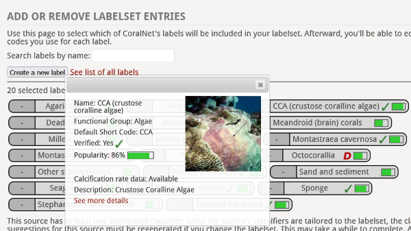

 

##### Co-PI: Dr. Andreas Andersson, Dr.Stephen Kriegman, Dr. Travis Courtney, Stephen Chan
##### Funded by  National Oceanographic and Atmosheric Administration

We developed a [tool to estimate coral reef carbonate production](https://coralnet.ucsd.edu/blog/coralnet-now-estimates-carbonate-production-rates/) to the automated coral reef image analysis software [CoralNet](https://coralnet.ucsd.edu/) and an [Excel tool](https://zenodo.org/record/7051628) to estimate net coral reef calcification from seawater chemistry data.

