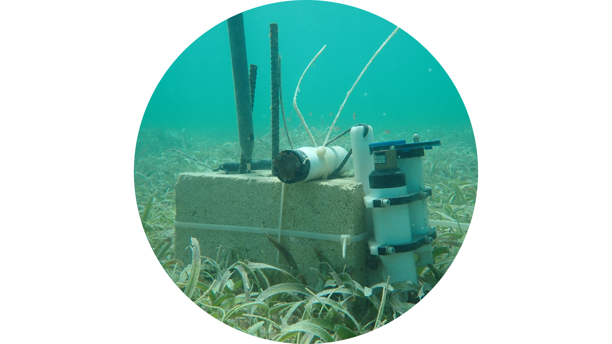

 

##### Co-PI: Dr. Travis Courtney, Catherine Hernandez Rodriguez
##### Funded by EcoElectrica & CARICAS

We are currently working on a project to quantify seagrass productivity, pH buffering, and blue carbon uptake in La Parguera Natural Reserve as part of the MS thesis of Catherine Hernandez Rodriguez with contributions to a broader [Caribbean Carbon Accounting in Seagrass](https://seagrass.fiu.edu/caricas.htm) project funded by the Nature Conservancy.

