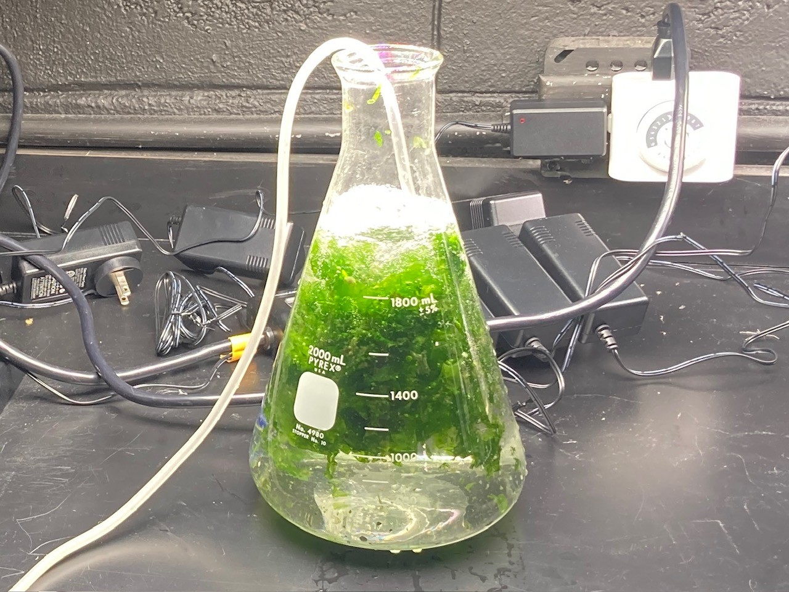

 

##### coPIs: Stacey Williams, Travis Courtney, Alexandra Gregory Crespo, Manuel Olmeda Saldaña
##### Funded by Puerto Rico Sea Grant

This project aims to develop an optimized Ulva seaweed aquaculture facility in La Parguera, Puerto Rico to sustain land-based sea urchin nurseries used for coral reef restoration and to assess the market feasibility to scale Ulva aquaculture into part of the emerging Blue Economy of Puerto Rico. We will be pairing lab-based Ulva seaweed growth experiments with field-based observations of Ulva seaweed growth and sporulation to better understand the drivers of Ulva seaweed growth and reproduction in Puerto Rico.

