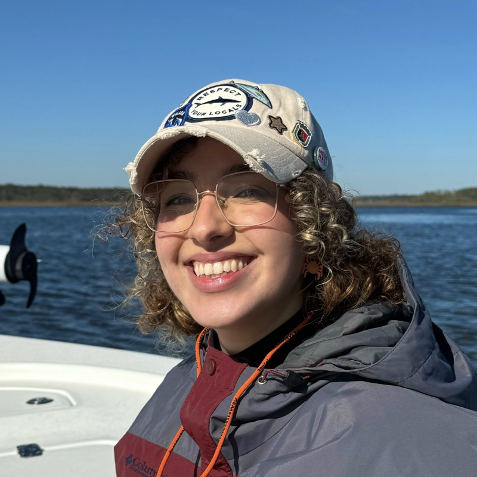

 

Meléndez-Pérez is researching how octocoral communities influence carbonate dynamics and biogeochemical functioning of coral reefs in Puerto Rico for her MS thesis. She is also monitoring seawater outflows of the EcoEléctrica power plant in Guayanilla Bay, Puerto Rico for regulatory compliance with DNA Environment LLC.

