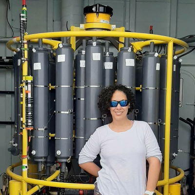

 

Mejías Rivera is researching the roles of ocean warming and food subsidies on coral reef ecosystems through a combination of traditional bottle samples and remote sensing to better understand the functional linkages between between the open ocean, coral reefs, seagrasses, and mangroves.

