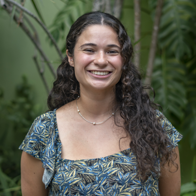

 

Melendez-Declet will be working on quantifying the drivers of Ulva seaweed to optimize tropical seaweed cultivation strategies to support ongoing development of the Puerto Rico blue economy for her MS thesis.

