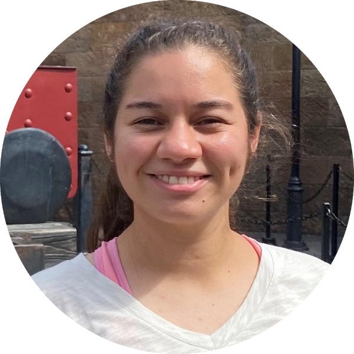

 

Luquis Ramos is currently investigating the role of Diadema sea urchin on coral reef herbivory and bioerosion to inform restoration targets as part of a project-based MS in collaboration with [ISER Caribe](https://www.isercaribe.org/).

