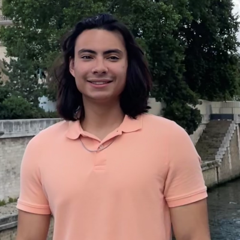

#### Leira Centeno Mejías
#### (she/her/hers)
#### MS Degree - 2023

Centeno-Mejias completed water quality compliance monitoring for the EcoEléctrica power plant in Guayanilla Bay, Puerto Rico as part of a project-based MS with DNA Environment LLC. 

#### Jose Martinez Ortiz
#### (he/him/his)
#### MS Degree - 2024

Martinez-Ortiz completed his thesis investigating the impacts of sargassum on coastal dissolved oxygen in La Parguera Natural Reserve for his MS thesis while assisting the monitoring seawater outflows of the EcoEléctrica power plant in Guayanilla Bay, Puerto Rico for regulatory compliance with DNA Environment LLC.  

#### Catherine Hernández Rodriguez
#### (she/her/hers)
#### MS Degree - 2024

Hernández Rodriguez quantified seagrass metabolism to better understand blue carbon uptake and seagrass bed biogeochemistry through a multidisciplinary approach to better understand the role of seagrass meadows for carbon sequestration and seawater buffering under ocean acidification.

