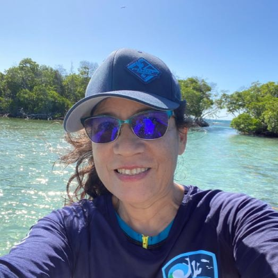
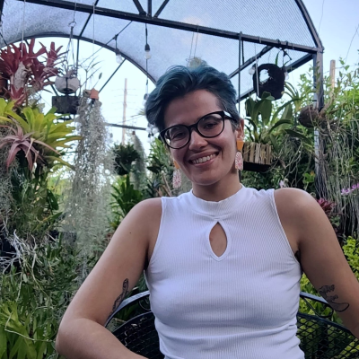
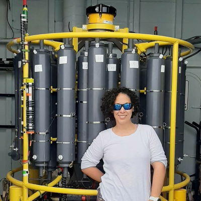
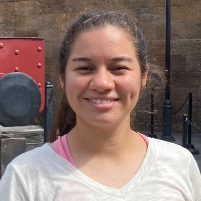

 

#### Dr. Martha Ricaurte
#### (she/her/hers)
#### Lab Manager 2022-2025

Dr. Ricaurte earned a PhD from the University of Puerto Rico Mayagüez and managed the [Caribbean Coral Reef Institute](https://www.uprm.edu/ccri/) Water Quality Lab to analyze seawater samples from coral reefs around Puerto Rico to evaluate the influence of water quality on coral reef condition.

 

#### Juanita Carballeira Martinez
#### (she/her/hers)
#### MS Degree - 2025

Carbelleira Martinez investigated vertical variability in seawater chemistry for her MS thesis and assisted with monitoring seawater outflows of the EcoEléctrica power plant in Bahía de Guayanilla, PR for regulatory compliance with DNA Environment.

 

#### Ignacio Rueda
#### (he/him/his)
#### MS Degree - 2025

Rueda explored coral contributions to deep sea benthic structural complexity using next-generation autonomous vehicles, cameras, and structure form motion modeling in the islands of Hawai'i for his MS thesis.

 

#### Dr. Carla Mejías Rivera
#### (she/her/hers)
#### PhD Degree - 2025

Mejías Rivera researched the roles of ocean warming and food subsidies on coral reef ecosystems through a combination of traditional in situ measurements and remote sensing to better understand the functional linkages between between the open ocean, coral reefs, seagrasses, and mangroves and their responses to climate change.

 

#### Irais Luquis Ramos
#### (she/her/hers)
#### MS Degree - 2025

Luquis Ramos is developed a tool to assess optimize Diadema sea urchin herbivory and bioerosion to inform restoration targets as part of a project-based MS in collaboration with [ISER Caribe](https://www.isercaribe.org/).

#### Catherine Hernández Rodriguez
#### (she/her/hers)
#### MS Degree - 2024

Hernández Rodriguez quantified seagrass metabolism to better understand blue carbon uptake and seagrass bed biogeochemistry through a multidisciplinary approach to better understand the role of seagrass meadows for carbon sequestration and seawater buffering under ocean acidification for her MS thesis.

#### Jose Martinez Ortiz
#### (he/him/his)
#### MS Degree - 2024

Martinez-Ortiz completed his thesis investigating the impacts of sargassum on coastal dissolved oxygen in La Parguera Natural Reserve for his MS thesis while assisting the monitoring seawater outflows of the EcoEléctrica power plant in Guayanilla Bay, Puerto Rico for regulatory compliance with DNA Environment LLC.  

#### Leira Centeno Mejías
#### (she/her/hers)
#### MS Degree - 2023

Centeno-Mejias completed water quality compliance monitoring for the EcoEléctrica power plant in Guayanilla Bay, Puerto Rico as part of a project-based MS with DNA Environment LLC. 

