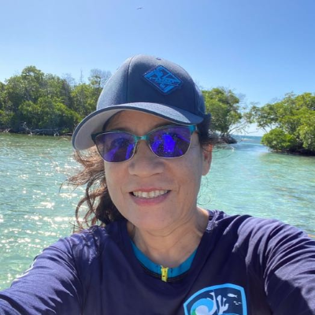

 

Dr. Ricaurte earned a PhD from the Univeristy of Puerto Rico Mayagüez and is currently managing the [Caribbean Coral Reef Institute](https://www.uprm.edu/ccri/) Water Quality Lab to analyze seawater samples from coral reefs around Puerto Rico to evaluate the influence of water quality on coral reef condition.

