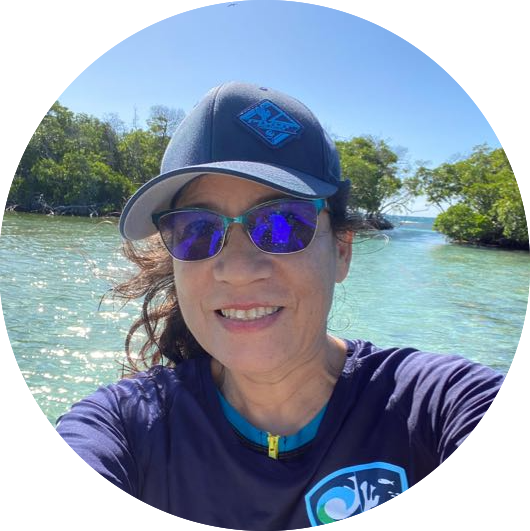
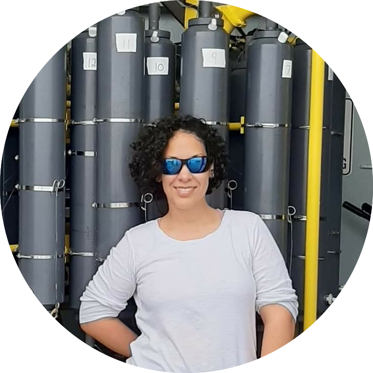
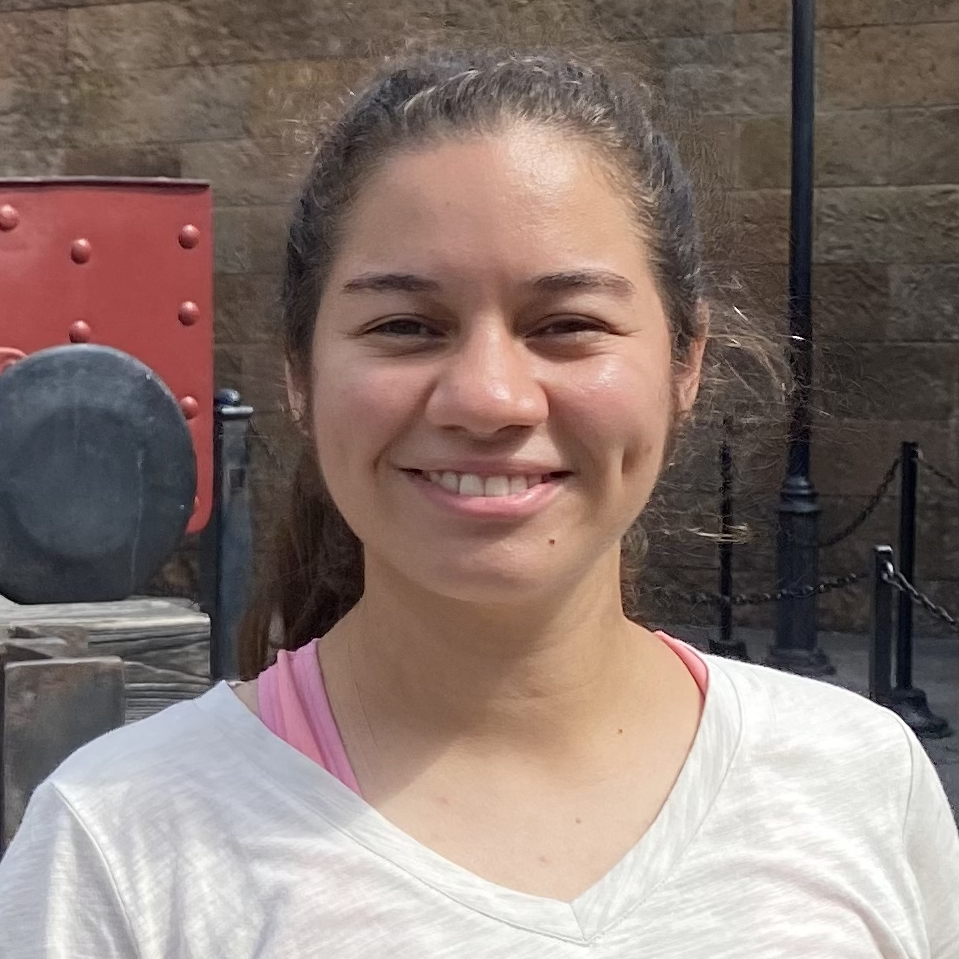

### Dr. Travis Courtney
####  (he/him/his)
#### Principal Investigator
#### travis.courtney@upr.edu

Dr. Courtney earned his B.S. in Geology and Environmental Science from the University of North Carolina at Chapel Hill where his research focused on the effects of temperature and ocean acidification on the growth rates and calcite stable isotopic composition of a tropical sea urchin. He then worked at Northeastern University to construct century-scale records of coral growth rates and skeletal geochemistry from Belize. Courtney completed his PhD and postdoc in Oceanography in the SCOOBY lab at Scripps Institution of Oceanography investigating the rates and drivers of coral reef calcification and developed user-friendly tools to assess net coral reef calcification from benthic imagery and seawater chemistry data. He is now an assistant professor in the Department of Marine Sciences at the University of Puerto Rico Mayagüez and an affiliated researcher of the [Caribbean Coral Reef Institute](https://www.uprm.edu/ccri/).

---

### Dr. Martha Ricaurte

#### Caribbean Coral Reef Institute Water Quality Lab Manager

#### martha.ricaurte@upr.edu

Dr. Ricaurte earned a PhD from the Univeristy of Puerto Rico Mayagüez and is currently managing the [Caribbean Coral Reef Institute](https://www.uprm.edu/ccri/) Water Quality Lab to analyze seawater samples from coral reefs around Puerto Rico to evaluate the influence of water quality on coral reef condition.

---

### Leira Centeno Mejías

####  (she/her/hers)

#### MS Student

#### leira.centeno@upr.edu

Centeno Mejías is currently monitoring seawater outflows of the EcoEléctrica power plant in Bahía de Guayanilla, PR for regulatory compliance as part of a project-based MS through coordinating field efforts, organizing data, and assisting with reports with DNA Environment.

---

### Catherine Hernández Rodriguez

####  (she/her/hers)

#### MS Student

#### catherine.hernandez2@upr.edu

Hernández Rodriguez is quantifying seagrass metabolism to better understand blue carbon uptake and seagrass bed biogeochemistry through a multidisciplinary approach to better understand the role of seagrass meadows for carbon sequestration and seawater buffering under ocean acidification.

---

### Carla Mejías Rivera

####  (she/her/hers)

#### PhD Student

#### carla.mejias@upr.edu

Mejías Rivera is researching the role of particulate organic carbon on coral reef ecosystems through a combination of traditional bottle samples and remote sensing along inshore-offshore transects to better understand the functional linkages between between the open ocean, coral reefs, seagrasses, and mangroves.

---

### Irais Luquis Ramos

####  (she/her/hers)

#### MS Student

#### irais.luquis@upr.edu

Luquis Ramos is currently investigating the role of Diadema sea urchin on coral reef herbivory and bioerosion to inform restoration targets as part of a project-based MS in collaboration with [ISER Caribe](https://www.isercaribe.org/).

---

### Juanita Carballeira Martinez

#### (she/her/hers)

#### MS Student

#### juanita.carballeira@upr.edu

Carbelleira Martinez is currently assisting with monitoring seawater outflows of the EcoEléctrica power plant in Bahía de Guayanilla, PR for regulatory compliance with DNA Environment and developing a thesis investigating vertical variability in seawater chemistry.

---

### Jose Martinez Ortiz

####  (he/him/his)

#### MS Student

#### jose.martinez203@upr.edu

Martinez-Ortiz is currently assisting with monitoring seawater outflows of the EcoEléctrica power plant in Bahía de Guayanilla, PR for regulatory compliancewith DNA Environment and developing a thesis to assess the drivers and variability of seawater dissolved oxygen within Bahía de Guayanilla.

---